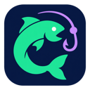
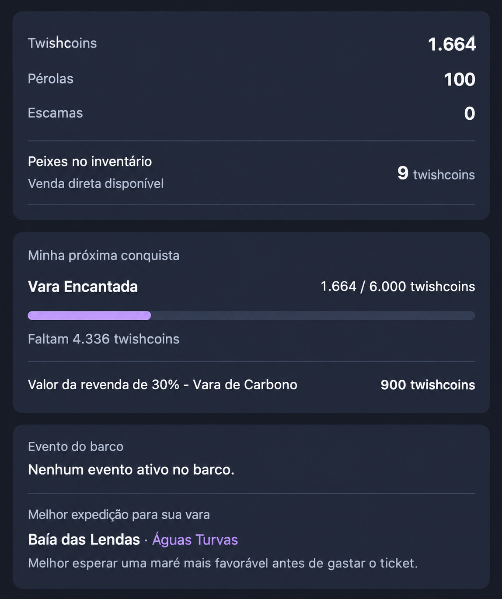
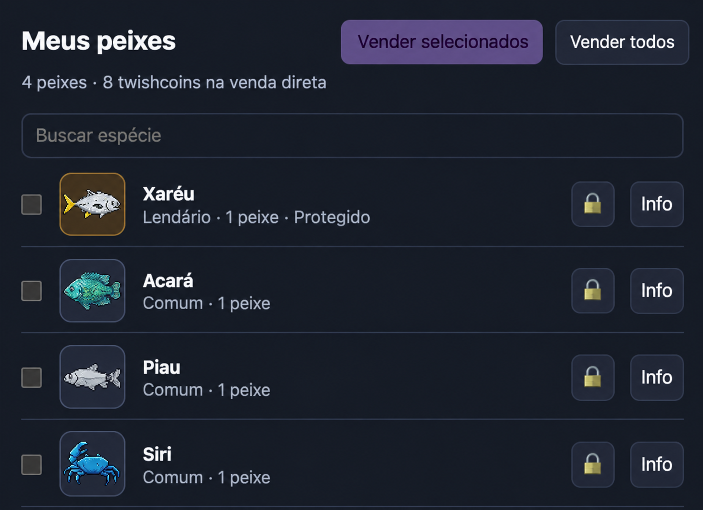

# Pesca Companion Manual

**Versão 2.8.44 · extensão para Google Chrome · interface em português**

**Créditos: [@MadtraxBR](https://www.twitch.tv/madtraxbr)**

Acompanhe a pesca da Twish enquanto assiste à Twitch: cooldown, equipamentos, inventário, marés e uma meta de compra, reunidos em um painel que pode ser movido e minimizado.

**Cada pesca exige um clique em Pescar.** O interruptor verde ativa o acompanhamento dos dados; ele não inicia pescas por conta própria.

## Tutorial em vídeo

**[Assistir ou baixar o tutorial em português](https://github.com/gbsoares1/pesca-companion-manual/blob/main/docs/videos/tutorial-chrome.mp4)** · 1 minuto e 48 segundos · com voz e legendas.

O vídeo mostra onde baixar o ZIP na release, as telas reais do Chrome para carregar a extensão, a ativação do monitor e a configuração da meta. Capturas do painel foram recortadas para remover a identificação. As etapas de extração, identificação da conta e troca de barco usam explicações ilustrativas. A release exibida é um exemplo; baixe a versão mais recente disponível.

## Tela de Status

O Status reúne saldos, valor disponível no inventário, meta, revenda da vara e informativo do barco.

> Os exemplos de Status e Inventário foram preparados a partir de capturas fornecidas pelo usuário, editados para excluir identificação pessoal. A imagem de Status também ajusta a apresentação da revenda à interface atual. As demais figuras são ilustrações com dados fictícios. Os valores são exemplos, não dados atuais de uma conta. Na instalação, imagens e dados disponíveis vêm da leitura dos sites oficiais.

## Documentação

| Guia | Conteúdo |
| --- | --- |
| [Instalação e primeiro uso](docs/INSTALACAO.md) | Download, instalação local, login, ativação, troca de barco e atualização |
| [Telas e funcionalidades](docs/FUNCIONALIDADES.md) | Status, Pesca, Inventário, Expedições, Progresso e confirmações |
| [Configurar progresso e metas](docs/PROGRESSO-E-METAS.md) | Selecionar varas e itens, moedas, salvar a meta, desconto e revenda |
| [Resolver problemas](docs/SOLUCAO-DE-PROBLEMAS.md) | Painel ausente, conexão, catálogo, inventário, envio e marés |
| [Arquitetura e contribuição](docs/ARQUITETURA.md) | Organização do código, fluxo dos dados e testes locais |
| [Histórico de versões](CHANGELOG.md) | Correções da série manual 2.8.39–2.8.44 |

## Instalação rápida

1. Baixe o pacote da extensão e extraia o ZIP.
2. Abra `chrome://extensions` no Chrome.
3. Ative **Modo do desenvolvedor**.
4. Clique em **Carregar sem compactação** e selecione a pasta que contém `manifest.json`.
5. Faça login na Twish e na Twitch. Na Twish, abra seu inventário no barco desejado em uma aba normal.
6. Recarregue a aba da Twitch. Confira a conta e o barco no cabeçalho do painel.
7. Ative o interruptor **Monitorar cooldown** e espere a primeira leitura.

Não é necessário compilar o projeto, instalar bibliotecas ou configurar uma chave de API para usar a extensão. Instale apenas uma edição do Pesca Companion por vez.

Esse método de instalação local segue o [guia oficial de extensões do Chrome](https://developer.chrome.com/docs/extensions/get-started/tutorial/hello-world).

## O que está disponível

| Recurso | Como funciona |
| --- | --- |
| Pesca manual | O botão envia `$pescar` ao chat próprio do barco quando há leitura recente e cooldown disponível |
| Status | Saldos, valor de venda direta dos peixes disponíveis, meta, evento e indicação de expedição |
| Equipamentos | Vara, anzol, mochila e isca; espaços vazios são identificados |
| Inventário | Lista por espécie, busca, seleção, proteção, informações e caminhos de venda com confirmação |
| Expedições | Destinos liberados para a vara, maré do dia e sugestões de oportunidade |
| Progresso | Meta de compra, saldo da moeda escolhida, valor que falta, resumo do dia e XP |
| Catálogo de metas | Varas, artigos de pesca e cosméticos com preço legível, inclusive pérolas e opções de escamas |
| Painel móvel | Arrastar pelo cabeçalho, minimizar, expandir e usar durante tela cheia |
| Contexto por conta e barco | Dados e metas locais separados; mudança de barco feita pela aba normal da Twish com o monitor pausado |

As abas disponíveis são Status, Pesca, Inventário, Expedições e Progresso. O resumo **Hoje** fica em Progresso; saldos e a visão rápida da meta ficam em Status.

## Exemplo de inventário

A imagem mostra as figuras das espécies, quantidades, proteção, busca e acesso às informações. Foi editada para documentação; não é uma validação de uma sessão atual.

## Abas de apoio

Ao ligar o monitor, a extensão mantém duas abas próprias fixadas: o inventário da Twish e o chat do barco na Twitch. O chat de apoio fica silenciado. As consultas usam essas referências; durante uma consulta, a aba da Twish pode visitar a loja ou o cais e voltar ao inventário.

O painel aparece nas páginas da Twitch e não aparece no site da Twish nem no chat popout de apoio. Os leitores na Twish continuam necessários para obter os dados.

## Dados e permissões

- `storage`: guarda estado, metas, dados consultados e posição do painel localmente no perfil do Chrome.
- `scripting`: carrega leitores nas páginas permitidas quando necessário.
- `alarms`: ajuda a manter as abas próprias de apoio; não agenda pescas nesta edição.
- Acesso a `https://www.twitch.tv/*` e `https://twish.com.br/*`: permite ler essas páginas e executar ações solicitadas pela interface.

A extensão depende das sessões abertas nesses serviços. Ela não solicita senha no painel e não tem servidor próprio de coleta no código desta versão. As ações de chat são transmitidas à Twitch, e operações no inventário acontecem na Twish.

As metas usam armazenamento local, não sincronização entre computadores. Outras abas do mesmo perfil recebem as mudanças. Confira [a arquitetura](docs/ARQUITETURA.md) para os detalhes.

## Escopo e manutenção

As páginas oficiais definem os preços finais, os requisitos, o saldo e a disponibilidade dos itens. A extensão depende da estrutura dessas páginas: alterações na Twitch ou na Twish podem exigir atualização dos leitores.

## Créditos

Criação, desenvolvimento e documentação: **[@MadtraxBR](https://www.twitch.tv/madtraxbr)**.
