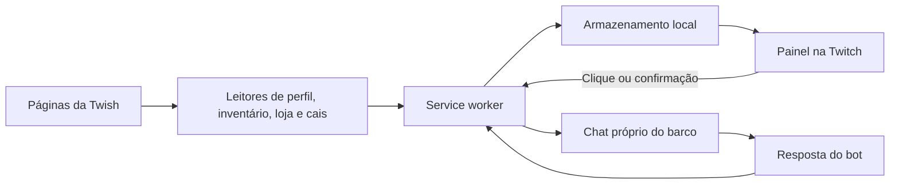

# Arquitetura e contribuição

[Voltar ao início](../README.md)

A versão manual usa Manifest V3, JavaScript e CSS sem compilação. O `manifest.json` define permissões, scripts e o service worker.

## Organização

| Arquivo | Responsabilidade |
| --- | --- |
| `manifest.json` | Nome, versão, permissões, ícones e ordem dos scripts |
| `background.js` | Estado, contexto, mensagens, abas próprias, consultas, cache e encaminhamento de ações |
| `boat-tracker.js` | Detectar conta/barco pela página ativa da Twish |
| `site-data.js` | Extrair identificação, perfil, saldos, equipamentos e campos compartilhados |
| `core.js` | Interpretar leituras do estado de pesca |
| `reader.js` | Ler inventário, contador, imagens e proteção na Twish |
| `page-reader.js` | Ler loja, ranking, torneio e solicitar leitura do cais |
| `twitch.js` | Interagir com o editor de chat e acompanhar respostas |
| `replies.js` | Interpretar mensagens do bot |
| `fish-details.js` | Interpretar detalhes textuais de um exemplar |
| `expeditions.js` | Ler destinos e marés; critérios de recomendação |
| `goals.js` | Desconto, alcance da meta e referência de revenda |
| `panel-template.js` | Estrutura e estilos do painel isolado por Shadow DOM |
| `panel-inventory.js` | Busca, seleção, proteção, Info e diálogos de venda |
| `panel-progress.js` | Editor de metas, resumo, progresso e aviso de meta alcançada |
| `panel.js` | Orquestrar interface, eventos, disposição, tela cheia e atualização |
| `icons/` | Ícones da extensão |
| `docs/` | Guias e ilustrações |
| `tests/` e `scripts/` | Testes locais e verificação de sintaxe, sem dependências externas |

A ordem dos scripts no manifesto importa: os módulos globais precisam estar carregados antes do código que os utiliza.

## Fluxo dos dados



O painel não aparece na Twish, mas os leitores continuam ativos nos caminhos permitidos. O chat próprio é uma referência de transporte; a aba da live que o usuário está assistindo não precisa ser o barco configurado.

## Estado e isolamento

Dados como perfil, inventário, meta, resumo, saldos e proteção usam chaves com a forma:

```text
boat:<barco>:<usuario>:<tipo_de_dado>
```

O estado do monitor e a posição do painel também são locais. Mudanças em `chrome.storage.local` são observadas pelas abas. Isso não equivale a sincronização remota.

As referências próprias usam identificadores de abas e registros de sessão/local para evitar criar novas abas em cada ação. A navegação pessoal ativa na Twish pode trocar o contexto apenas com o monitor pausado; as abas próprias não devem definir essa troca como se fossem navegação pessoal.

## Cache e atualização

- Inventário pode solicitar leitura renovada ao abrir a aba e acompanhar notificações do armazenamento.
- Loja considera dia, situação de desconto e versão do catálogo; Atualizar loja força a consulta.
- Expedições consideram barco/conta, vara equipada e dia.
- Com o monitor ligado, conta e barco ficam preservados. Pause antes de selecionar outro contexto pela Twish; a mudança descarta os dados apresentados do contexto anterior e recupera os correspondentes.
- A seleção provisória de item não troca o resumo da meta até Salvar meta.

Os seletores DOM são contratos com os sites. Por exemplo, a loja tem cartões `.shop-item` e `.shop-hanger`, e um cartão pode oferecer mais de uma `.shop-tag` com moedas distintas. O leitor numérico deve usar o valor do preço e excluir o selo percentual de desconto.

## Ações e pesca manual

O envio passa por preparação do editor, confirmação do comando e acionamento do botão oficial de chat. O código verifica o contexto da aba própria e evita sobrescrever um rascunho pessoal. Falha de confirmação não gera repetição automática.

A pesca manual exige um evento de clique real na interface, monitor ativo, leitura recente, cooldown disponível e ausência de erro/duplicidade. Os alarmes existentes mantêm referências de monitoramento; não enviam pescas por temporizador.

## Testes incluídos

É necessário Node.js com suporte aos recursos usados pelo código e pelos testes. Os testes não exigem instalação de pacotes externos.

Na raiz do repositório:

```sh
node scripts/verificar.cjs
```

O verificador testa a sintaxe dos JavaScript da extensão e executa:

| Teste | Cobertura |
| --- | --- |
| `page-integration.cjs` | Scripts reais de identificação, loja e cais com DOM simulado; preço com desconto, moedas alternativas e duas contas |
| `restoration.cjs` | Maré no Status, destino sem nota, meta salva, seleção provisória, opção de pérolas e fim do desconto |
| `chat-submit.cjs` | Clique oficial único, campo limpo, rascunho preservado e botão indisponível |
| `inventory.cjs` | Peixes separados de equipamentos, quantidade, imagem e venda direta |
| `fish-response.cjs` | Texto parcial, resposta anterior, resumo, mandi/lula, outra conta e timeout |
| `owned-tabs.cjs` | Abas próprias fixas, contexto preservado, captura publicada imediatamente e ausência de confirmação |

Esses testes são verificações locais com fixtures. Não fazem login, não enviam mensagens e não compram/vendem itens. Não constituem validação de ponta a ponta nos sites reais.

## Antes de propor uma alteração

Descreva o comportamento que mudou, a forma de reproduzir e a validação feita. Execute o verificador e revise no Chrome as telas afetadas. Preserve a separação por conta/barco, os leitores necessários na Twish, as confirmações de venda e o clique explícito da pesca manual.

Quando uma mudança afetar instalação, campos, menus ou permissões, atualize também a documentação e o histórico. As figuras incluem ilustrações e um exemplo editado a partir de captura anonimizada; atualize legendas e conteúdo quando os campos mudarem.

## Créditos

Criação, desenvolvimento e documentação: **[@MadtraxBR](https://www.twitch.tv/madtraxbr)**.
