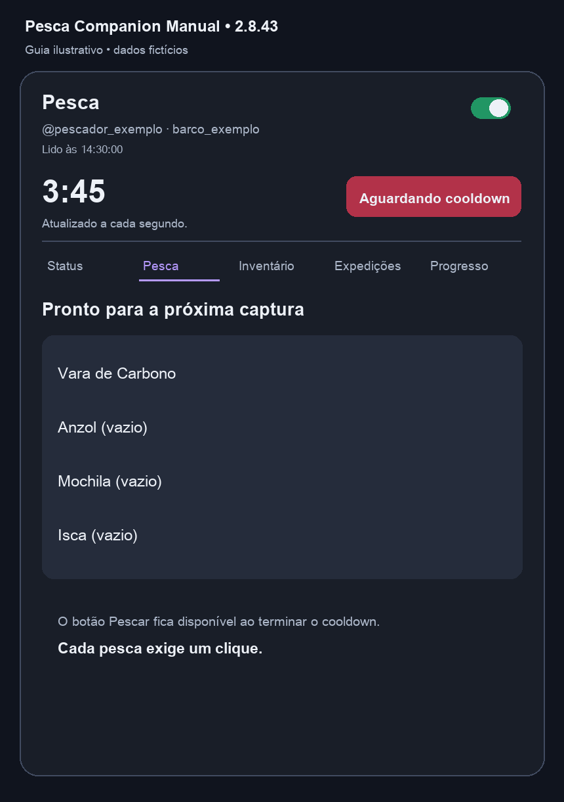
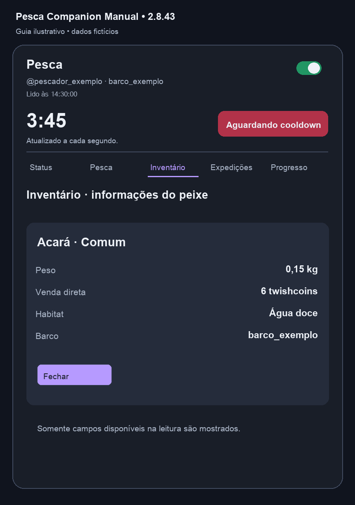
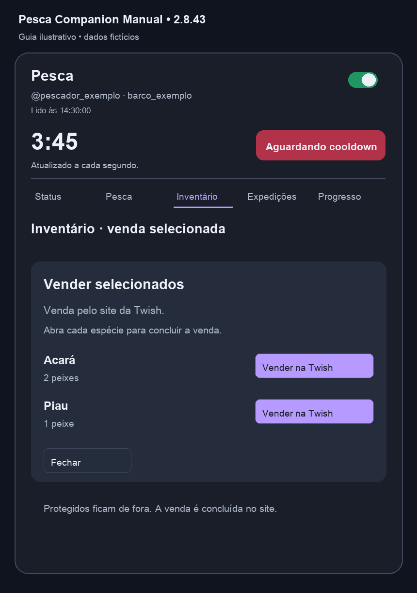
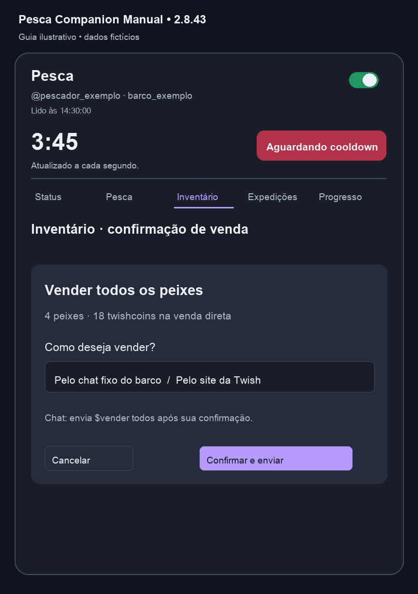
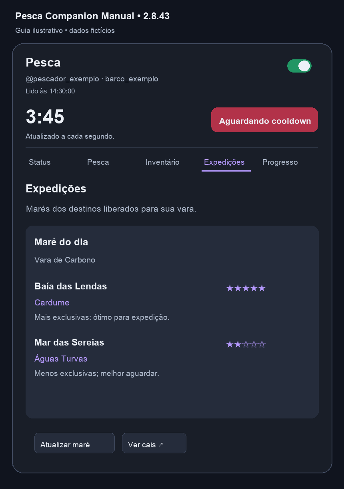
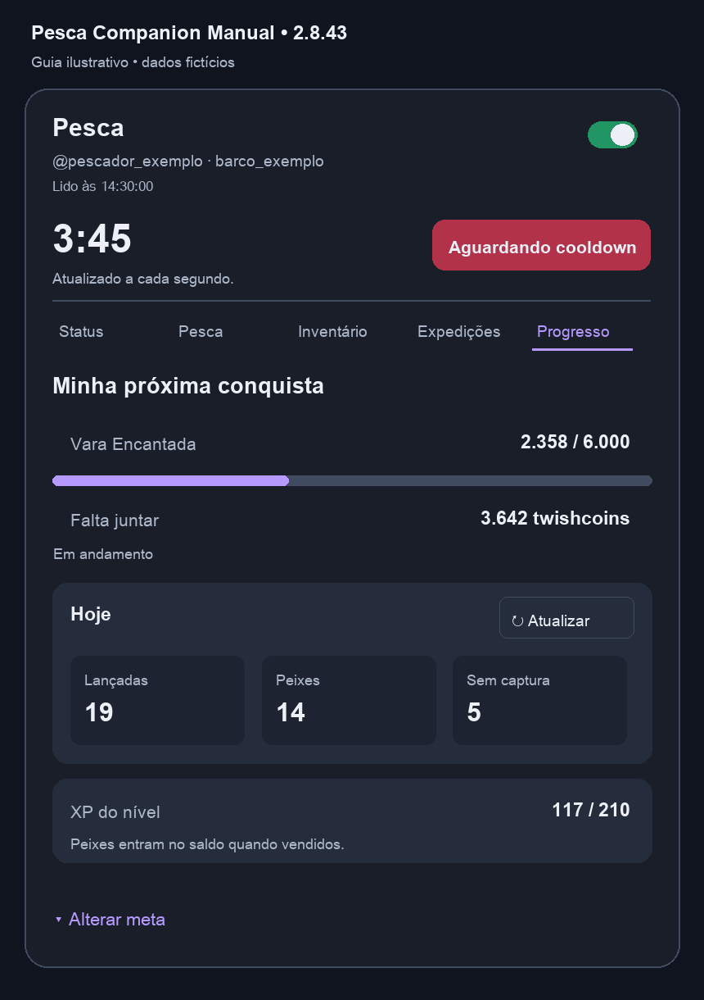
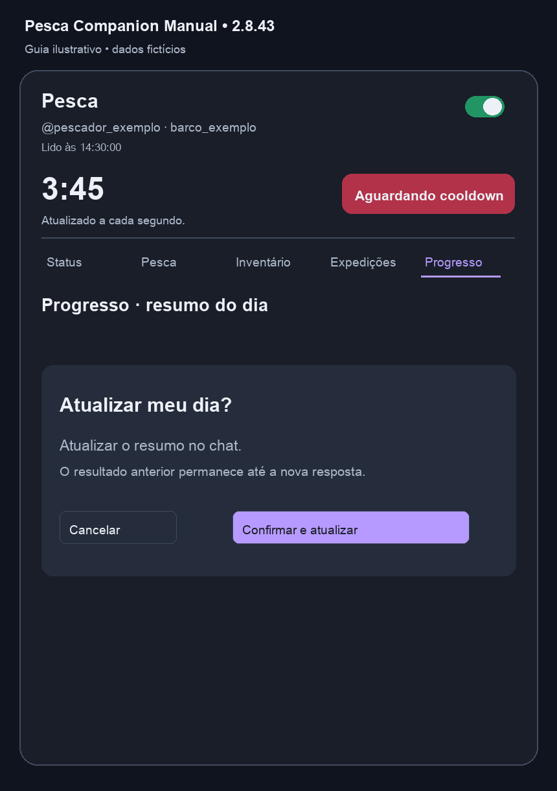

# Telas e funcionalidades

[Voltar ao início](../README.md)

As cinco abas disponíveis são **Status**, **Pesca**, **Inventário**, **Expedições** e **Progresso**. Status é a primeira da lista.

Os exemplos de Status e Inventário foram preparados a partir de capturas fornecidas pelo usuário, editadas para excluir dados de identificação. A figura de Status também atualiza a apresentação da revenda. As demais figuras são ilustrações com dados fictícios. Na instalação, imagens de peixes, equipamentos e cadeados dependem do que a Twish fornecer.

## Cabeçalho e bloco de pesca

Essa região acompanha as abas e reúne:

| Campo | Significado |
| --- | --- |
| Conta e barco | Contexto usado para ler dados e encaminhar comandos |
| Lido às | Horário da última leitura apresentada, no horário de São Paulo |
| Interruptor | Liga ou pausa o monitor |
| `−` / `+` | Minimiza ou expande o painel |
| Contador | Tempo restante; pode mostrar Disponível, Pausado, Conectando… ou Atenção |
| Pescar | Envia uma pesca manual quando as condições de leitura permitem |
| Resultado | Resposta da captura no próprio bloco superior |

A leitura do cooldown precisa estar recente, o monitor precisa estar ligado e não pode haver erro ou outra tentativa em andamento. Existe uma proteção de pelo menos 15 segundos entre tentativas de pesca, que não substitui o cooldown do jogo.

Quando há resposta reconhecida, a captura apresenta o peixe. Uma resposta reconhecida de falha apresenta **Não foi desta vez pescador.** Mensagens parciais, resumos do dia e respostas anteriores ao comando atual são ignorados. Se o resultado não puder ser confirmado, o painel informa essa condição, sem inventar uma pesca perdida. Falhas de transporte, conta, verificação ou envio podem mostrar uma mensagem específica. O resultado de captura permanece visível por **8 segundos**. A espera por uma resposta do bot é limitada; a ausência de resposta não provoca reenvio automático.

## Status

Use esta aba para conferir rapidamente:

- Twishcoins, pérolas e escamas consultados.
- Valor de venda direta disponível no inventário.
- Nome da meta salva, saldo, custo e valor que falta.
- Revenda de 30% da vara atual, quando a comparação entre varas é aplicável.
- Evento do barco e aviso de meta alcançada.
- Sugestão de expedição para a vara equipada, baseada na maré consultada.

O valor dos peixes é potencial de venda, não dinheiro já recebido. A venda direta disponível lida no inventário oficial exclui os itens que a Twish não permite vender por essa ação, incluindo protegidos e Deuses Anciões. Ele não é uma estimativa de preço de mercado.

O aviso de meta alcançada aparece quando o saldo da moeda selecionada cobre o custo considerado pelo painel. Ainda pode existir um requisito de equipamento na loja. [Veja os cálculos e a revenda](PROGRESSO-E-METAS.md).

O link **Abrir inventário fixo** não é exibido no Status; ele permanece nas outras áreas aplicáveis.

## Pesca

Mostra os equipamentos consultados: vara, anzol, mochila e isca. Se o slot estiver vazio, essa condição aparece no nome. Quando existe imagem ou ícone disponível na leitura, o painel a utiliza.

A troca de equipamento é feita na Twish. O painel acompanha o que foi lido no inventário; ele não equipa itens por essa tela.

## Inventário

Exemplo preparado a partir da captura do usuário: Xaréu protegido, Acará, Piau e Siri. A imagem foi editada para uso no guia e não representa valores atuais de uma conta.

A aba lista espécies, raridade, quantidade e proteção. Ao abrir Inventário com o monitor ligado, a extensão solicita uma atualização; por isso não existe um botão Atualizar nessa tela.

### Buscar e selecionar

Digite parte do nome em **Buscar espécie**. A busca filtra a lista e permanece durante a atualização do contador. Marque as caixas das espécies sem proteção para habilitar **Vender selecionados**.

A seleção é por espécie: confira a quantidade exibida. Se o inventário ou o barco mudar durante uma revisão, a operação pode exigir que você feche e revise a seleção novamente.

### Proteger uma espécie

O botão de cadeado altera a proteção pela Twish. Quando protegido, o painel utiliza o cadeado oficial disponível; a situação sem proteção usa o cadeado do painel. Espécies protegidas não podem ser selecionadas para venda pela lista.

Confira a proteção no inventário oficial quando houver dúvida. A extensão acompanha a whitelist/proteção lida no site.

### Consultar Info

O botão **Info** abre um diálogo com os campos disponíveis no exemplar consultado. Podem aparecer peso, venda direta, faixa da espécie, habitat, percentual do peso máximo, pescador, barco, data e origem. Campos não encontrados na leitura são omitidos.

A lista deixa de usar o antigo botão de venda individual: a consulta fica em Info, e a venda das espécies escolhidas passa pelo diálogo de seleção.

### Vender selecionados

1. Marque espécies sem proteção.
2. Clique em **Vender selecionados**.
3. No diálogo, confira as espécies e as quantidades.
4. Use **Vender na Twish** na espécie desejada.
5. Conclua a venda no inventário oficial que foi aberto.

Esta opção usa o **site da Twish**. Abrir o diálogo ou a espécie não conclui a venda. A extensão não envia um comando de chat para cada item selecionado.

### Vender todos

O diálogo permite escolher:

| Método | Ação |
| --- | --- |
| Pelo chat fixo do barco | Confirmar envia `$vender todos` uma vez; a Twish define o resultado final |
| Pelo site da Twish | Continuar abre o inventário; você conclui a venda no site |

Quando existem espécies protegidas, o diálogo bloqueia a confirmação pelo chat e orienta usar a seleção ou conferir no site. Depois das ações e de novas leituras, o inventário e o total de venda são atualizados. A venda efetiva é confirmada pelo jogo, não apenas pela abertura do diálogo.

## Expedições

A tela utiliza os destinos visíveis no cais e apresenta os liberados para a vara atual. A maré é consultada por barco, dia e vara. **Atualizar maré** solicita nova consulta; **Ver cais** abre a página oficial.

As estrelas são critérios de orientação do painel, não uma probabilidade calculada de recompensa:

| Maré | Indicação implementada |
| --- | --- |
| Cardume | 5 estrelas; mais exclusivas |
| Maré Cheia | 4 estrelas; mais fisgadas |
| Calmaria | 3 estrelas em destinos comuns; 4 em Sereias/Abismo pela redução de perigo |
| Nevoeiro | 4 estrelas; mais exclusivas, com atenção ao risco e ao seguro |
| Águas Turvas | 2 estrelas; menos exclusivas |
| Maré Baixa | 1 estrela; menos fisgadas |
| Sem maré reconhecida | Sem nota; consultar as condições no cais |

A sugestão no Status escolhe entre os destinos acessíveis consultados. Esta tela é informativa: não compra tickets, não contrata seguro e não inicia uma expedição.

## Progresso

Reúne a próxima conquista, barra de progresso, valor que falta, resumo **Hoje**, XP e o editor **Alterar meta**.

**Hoje** apresenta lançadas, peixes e tentativas sem captura da última resposta reconhecida do bot. Clique em **Atualizar**, revise o diálogo e confirme para enviar `$hoje`. O resumo anterior permanece salvo até uma nova resposta.

O XP é consultado no perfil, não calculado a partir das quantidades de Hoje. [O passo a passo de configuração das metas está neste guia](PROGRESSO-E-METAS.md).

## Painel móvel, minimizado e em tela cheia

Arraste pelo cabeçalho para mover nas direções horizontal e vertical. Use `−` e `+` para alternar a apresentação. Minimizar não desliga o monitor. A implementação acompanha as mudanças de tela cheia e conserva posições para os dois tamanhos.

Se houver pouco espaço vertical, role o conteúdo do painel para acessar a lista e as ações. Se um comportamento visual falhar em uma página, siga [as orientações de problemas](SOLUCAO-DE-PROBLEMAS.md).

## Escopo da edição manual

Os antigos blocos desativados de Mercado, atalhos e ações de equipamento foram removidos do código da interface. O resumo do dia continua em Progresso, os saldos em Status e a alteração de equipamento no site oficial. Cada pesca exige um clique.

## Créditos

Criação, desenvolvimento e documentação: **[@MadtraxBR](https://www.twitch.tv/madtraxbr)**.
