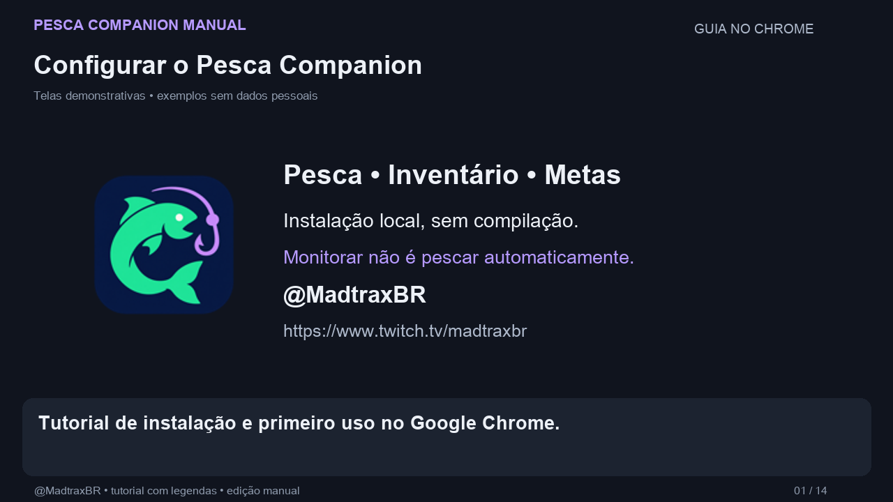
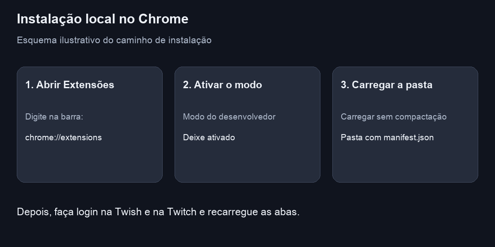
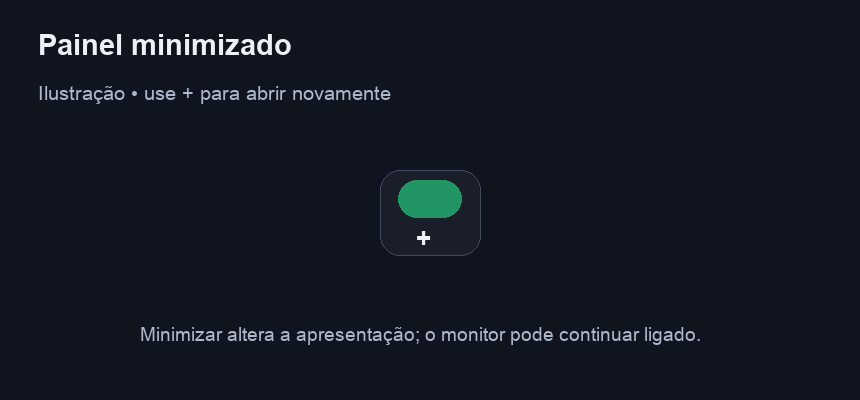

# Instalação e primeiro uso

[Voltar ao início](../README.md)

## Tutorial narrado

[Assistir ou baixar o vídeo em português](https://github.com/gbsoares1/pesca-companion-manual/blob/main/docs/videos/tutorial-chrome.mp4). Duração: **1 minuto e 48 segundos**, com voz, legendas e capturas reais do GitHub, Chrome e painel. Os detalhes ilustrativos complementam as capturas; a versão exibida na release é um exemplo.

## Antes de começar

Você precisa do Google Chrome, de acesso à Internet e de sessões conectadas na Twitch e na Twish. Abra o inventário da sua própria conta no barco que deseja acompanhar. O usuário identificado no cabeçalho deve corresponder ao inventário usado pela extensão.

A distribuição documentada aqui é uma **extensão local sem compactação**. O ZIP serve para transportar os arquivos; o Chrome carrega a pasta extraída. O pacote deve ser extraído antes da instalação.

## 1. Obter o projeto

Abra a [release mais recente](https://github.com/gbsoares1/pesca-companion-manual/releases/latest), baixe **pesca-companion-manual.zip** em **Assets** e extraia o arquivo. Se houver uma pasta externa, entre nela até encontrar `manifest.json`.

Não é preciso executar `npm install` ou outro preparo para a instalação.

Mantenha essa pasta em um local permanente. O Chrome continuará usando seus arquivos enquanto a extensão estiver carregada.

## 2. Carregar no Chrome

1. Digite `chrome://extensions` na barra de endereços.
2. Ative **Modo do desenvolvedor**, normalmente no canto superior direito.
3. Clique em **Carregar sem compactação**.
4. Selecione a pasta que contém `manifest.json`, `background.js` e os demais arquivos da extensão.
5. Confira o cartão **Pesca Companion Manual**, versão **2.8.44**, e deixe-o ativado.

Não selecione o ZIP. Se o Chrome disser que não encontrou o manifesto, provavelmente foi selecionada a pasta externa ou uma subpasta como `docs` ou `icons`.

Os nomes dos controles podem variar com o idioma do navegador. O procedimento segue a [documentação oficial do Chrome](https://developer.chrome.com/docs/extensions/get-started/tutorial/hello-world).

## 3. Preparar conta e barco

1. Entre na Twitch na conta que vai enviar os comandos.
2. Entre na Twish na conta do jogador.
3. Na Twish, abra o inventário do barco desejado em uma **aba normal**, fora das abas fixas criadas pela extensão.
4. Deixe essa aba ativa para que a extensão identifique a conta e o barco.
5. Abra ou recarregue uma página da Twitch.
6. Confira o cabeçalho do painel: `@seu_usuario · nome_do_barco`.

A extensão detecta o contexto pelas páginas da Twish; não existe um formulário de senha, de usuário ou de barco no painel. Se aparecer **Conta pendente**, mantenha uma página da Twish conectada e consulte o [guia de problemas](SOLUCAO-DE-PROBLEMAS.md).

## 4. Ativar o acompanhamento

Clique no interruptor **Monitorar cooldown**. A cor verde indica que o monitor está ligado.

Serão mantidas duas abas próprias fixadas, no canto da barra de abas:

| Aba | Função |
| --- | --- |
| Inventário da Twish | Contador, equipamentos, peixes, valores e consultas auxiliares |
| Chat popout da Twitch | Envio dos comandos confirmados e leitura das respostas do barco |

Essas abas são referências da extensão. Mantenha-as abertas e conectadas. Ao consultar loja e cais, a aba própria da Twish pode mudar temporariamente de página. Você pode continuar assistindo a outra live: o contexto da pesca permanece sendo o barco do cabeçalho.

## 5. Fazer a primeira pesca

Quando a leitura estiver recente e o cooldown chegar a zero, o painel mostrará **Disponível** e liberará **Pescar**.

1. Confira a conta e o barco.
2. Clique uma vez em **Pescar**.
3. Aguarde a resposta no bloco superior do painel.
4. Se houver captura, veja o nome do peixe; uma falha reconhecida indica que não foi desta vez. Ausência de resposta confirmada e problemas de envio aparecem separadamente.

A edição manual não pesca por temporizador nem confirma pesca automaticamente depois de alguns segundos. Cada envio exige seu clique.

## Pausar e minimizar

**Pausar:** desligue o interruptor. O acompanhamento para e a extensão fecha suas próprias referências, preservando as abas pessoais.

**Minimizar:** use o botão `−` do cabeçalho. O painel fica compacto, mas o acompanhamento pode continuar ligado. Use `+` para expandir. O interruptor e a apresentação compacta têm funções diferentes.

Arraste pelo cabeçalho para reposicionar. A posição compacta e a expandida são mantidas separadamente. O painel também foi implementado para acompanhar a entrada e a saída da tela cheia.

## Trocar de barco

Pause o monitor pelo interruptor. Abra o inventário do novo barco em uma aba normal da Twish e deixe essa aba ativa. Depois ligue o monitor novamente. Confira a mudança no cabeçalho da Twitch antes de executar uma ação.

A extensão reutiliza suas abas de referência para o novo contexto. Os dados e a meta do barco anterior continuam separados no armazenamento local. Ao voltar a ele, a meta correspondente pode ser recuperada.

## Atualizar a extensão

1. Substitua os arquivos da pasta instalada pelos arquivos da nova versão, mantendo a pasta completa.
2. Abra `chrome://extensions` e clique em **Recarregar** no cartão da extensão.
3. Recarregue as páginas da Twitch e da Twish.
4. Confira a versão e aguarde uma nova leitura.

Se aparecer **Extensão atualizada. Recarregue esta página.**, recarregue a aba indicada. Não é necessário remover a extensão para uma atualização comum. A preservação de metas depende de manter a mesma instalação e o mesmo perfil do navegador; remover a extensão pode apagar seus dados locais.

## Créditos

Criação, desenvolvimento e documentação: **[@MadtraxBR](https://www.twitch.tv/madtraxbr)**.
