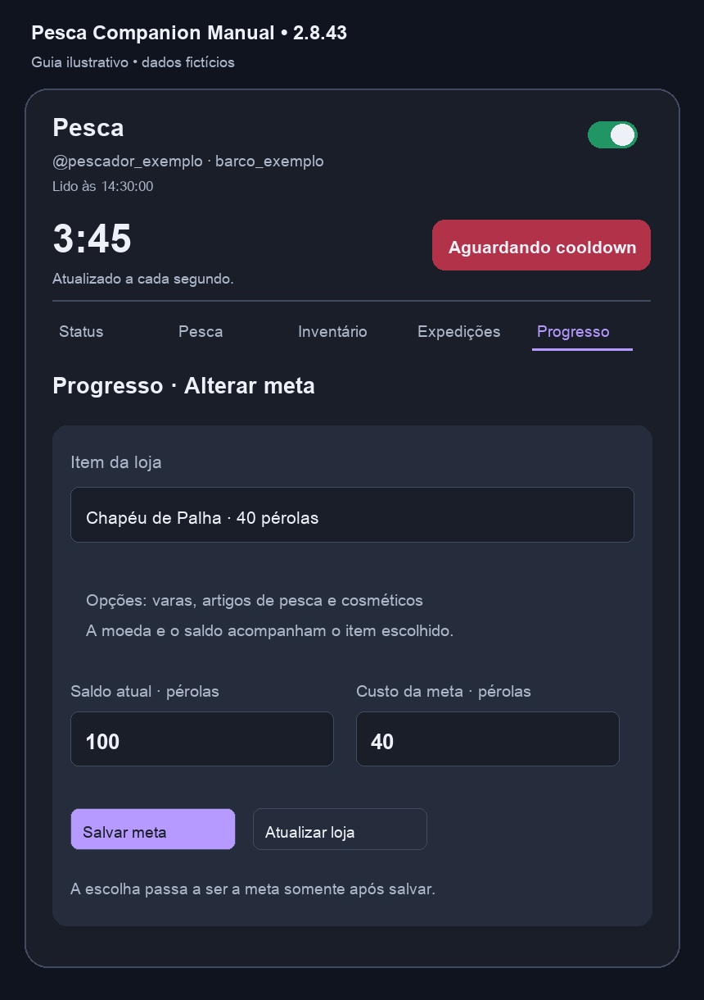

# Configurar progresso e metas

[Voltar ao início](../README.md)

Uma meta é um item da loja que você deseja comprar. A extensão compara o saldo da moeda escolhida com o custo desse item e mostra quanto falta. Definir uma meta não compra, vende ou equipa nada.

## 1. Abrir o editor

1. Confira a conta e o barco no cabeçalho.
2. Mantenha o monitor ligado e aguarde a leitura dos dados.
3. Clique em **Progresso**.
4. Abra **Alterar meta**. Se ainda não existir uma meta, o editor abre durante o carregamento.
5. Aguarde o catálogo em **Item da loja**.

O catálogo percorre as categorias da loja e considera cartões de artigos de pesca e cosméticos. Itens sem preço/moeda legíveis, gratuitos ou já exibidos apenas como equipados/no inventário podem não aparecer como opção de compra. Itens bloqueados por requisito podem aparecer com o requisito informado.

## 2. Escolher uma vara ou outro item


No seletor, cada opção mostra **nome · preço · moeda**. Exemplos de categorias disponíveis na leitura:

- Varas e anzóis.
- Mochilas e iscas.
- Impulsos, cuidados e outros artigos de pesca.
- Tickets e itens de apoio listados na loja.
- Cosméticos, como chapéus, camisas, calças e skins de vara.

A lista depende dos itens presentes no barco e no catálogo oficial naquele momento. Ela não é uma lista fixa cadastrada na extensão.

Ao selecionar, confira a imagem, o requisito, **Saldo atual** e **Custo da meta**. Os campos de valores são somente leitura e acompanham a moeda do item.

## 3. Escolher a moeda correta



| Moeda da opção | Saldo usado |
| --- | --- |
| Twishcoins | Twishcoins consultados no perfil |
| Pérolas | Pérolas consultadas no perfil |
| Escamas | Escamas consultadas na loja |

Um mesmo item pode aparecer mais de uma vez quando a loja oferece moedas alternativas. Por exemplo, uma opção em pérolas e outra em escamas são metas distintas. Escolha a moeda que deseja usar; a extensão não soma moedas diferentes nem converte uma em outra.

Se a opção usa pérolas, o saldo em twishcoins não ajuda a completar essa meta. O painel compara pérolas com pérolas.

## 4. Salvar

Clique em **Salvar meta**. Só depois disso a escolha passa a ser a meta principal apresentada em Progresso e Status.

Enquanto você apenas navega pelas opções, o resumo continua mostrando a meta anterior. Ao salvar, o editor fecha e aparece a confirmação de meta salva para o barco.

A meta é guardada localmente por **conta e barco**. Outras abas do mesmo perfil do Chrome acompanham a mudança; outro computador ou perfil não recebe essa meta por sincronização em nuvem.

## 5. Entender o cálculo

A fórmula principal é:

```text
Falta juntar = máximo entre 0 e (custo considerado − saldo da moeda)
Progresso = saldo da moeda ÷ custo considerado × 100, limitado a 100%
```

Exemplo ilustrativo de uma Vara Encantada:

| Situação | Custo considerado | Saldo | Falta juntar |
| --- | ---: | ---: | ---: |
| Preço normal | 6.000 twishcoins | 2.358 | 3.642 twishcoins |
| Evento de 20% ativo | 4.800 twishcoins | 2.358 | 2.442 twishcoins |
| Preço normal, saldo suficiente | 6.000 twishcoins | 6.100 | 0 |

Quando o custo é coberto, a barra chega a 100% e o painel informa **Meta alcançada!**. O Status também apresenta o aviso no informativo do barco.

## Desconto temporário

Na implementação atual, um evento reconhecido como **Desconto na Loja! 20%** faz o painel considerar 80% do preço-base das metas em twishcoins. Metas em pérolas ou escamas não recebem essa redução.

O preço-base é preservado na meta salva. Quando o evento termina, a comparação volta ao valor normal. O catálogo da loja é renovado quando a situação de desconto ou o dia muda, e **Atualizar loja** força uma nova consulta.

**Limite atual:** a regra do painel aplica a redução por moeda/evento, sem uma lista de exceções por item. Alguns artigos podem manter preço próprio na loja. Confira sempre o preço efetivo e os requisitos no cartão oficial antes de comprar; para varas, o exemplo acima representa o comportamento esperado do desconto.

## O valor dos peixes entra na meta?

Não. **Venda direta disponível** é um valor informativo separado. Os peixes ainda não vendidos não são acrescentados ao saldo usado pela barra de progresso.

Depois de concluir uma venda e receber a leitura do novo saldo, o progresso passa a considerar os twishcoins recebidos. Essa separação evita tratar um potencial de venda como dinheiro já disponível.

## A revenda da vara atual é descontada do que falta?

Não. A linha **Valor da revenda de 30% - nome da vara** é uma referência separada no Status. Ela aparece quando a meta e a vara atual estão entre as varas reconhecidas e a meta representa uma vara mais cara.

Exemplo:

```text
Vara atual: Vara de Carbono
Preço de referência: 3.000 twishcoins
Revenda exibida: 3.000 × 30% = 900 twishcoins
```

A barra e **Falta juntar** continuam usando o saldo efetivamente consultado. Os 900 só entram no saldo depois de uma venda realizada e lida. A extensão não vende a vara automaticamente e não desconta antecipadamente esse valor.

Essa referência usa preços de varas conhecidos no código e arredonda a revenda para baixo. O site continua sendo a referência para o valor real de venda e para os requisitos da troca.

## Requisitos e meta alcançada

Ter o dinheiro não significa que a compra está liberada. Uma vara pode exigir outra vara anterior; itens também podem depender de condições do jogo.

O editor mostra o requisito quando a leitura da loja o fornece. O aviso de meta alcançada significa que **o saldo cobre o custo calculado pelo painel**, e não que todos os requisitos foram validados.

## Atualizar ou mudar a meta

- Para trocar o item: abra Alterar meta, escolha outra opção e clique em Salvar meta.
- Para renovar a lista: clique em Atualizar loja e espere a consulta terminar.
- Para conferir outra conta ou barco: altere o contexto pela aba normal da Twish e confira o cabeçalho.
- Para atualizar Hoje: use o botão Atualizar do cartão Hoje e confirme o diálogo; isso é separado da atualização do catálogo.

Se o seletor mostrar **Erro ao carregar itens**, não salve uma opção vazia. Confira o login, o monitor e o contexto e consulte [a solução de problemas](SOLUCAO-DE-PROBLEMAS.md).

## Créditos

Criação, desenvolvimento e documentação: **[@MadtraxBR](https://www.twitch.tv/madtraxbr)**.
